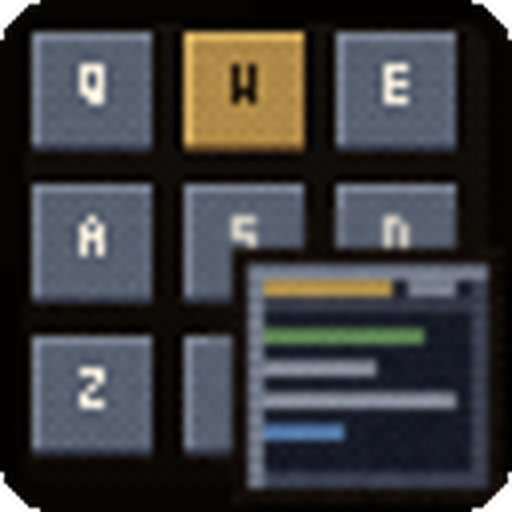

# Glimpse: KeybindsTooltip

<p align="center"></p>

Shows the keyboard, mouse and click-cast bindings of spells, items and macros in their tooltips.

Requires [Glimpse](https://github.com/N3zr0k/Glimpse) 0.2.2 or newer. For WoW Forever (interface 16001).

## Contents

* [Features](#features)
* [Options](#options)
* [Commands](#commands)
* [Installation](#installation)
* [For developers](#for-developers)
* [Credits](#credits)
* [License](#license)

## Features

Hover a spell, an item or a macro and the tooltip gets a "Keybindings" section, one row per kind:

```
Keybindings
[icon] Keyboard      SHIFT-1, F5
[icon] Mouse         Mouse 4
[icon] Click-Cast    Shift Left Click
```

* Scans all action bars including stance, bonus, override and vehicle bars, your macros and Blizzard click-casting.
* Bindings are read again whenever they change, no manual refresh needed.
* Everything the game hides from addons is skipped safely.

## Options

Open them with `/gli config`, then Glimpse > KeybindsTooltip. Settings follow the Glimpse profile.

* Show keyboard, mouse and click-cast bindings, each on its own.
* Only while a key is held: Shift, Ctrl and/or Alt (all selected keys must be held).

## Commands

| Command | Does |
| --- | --- |
| `/gli keybinds refresh` | Reads the bindings again |
| `/gli keybinds list` | Prints all stored bindings, the action bar page and bonus bar offset (troubleshooting) |

## Installation

Install [Glimpse](https://github.com/N3zr0k/Glimpse/releases) first, then unpack this addon next to it into the AddOns
folder of the Forever client, during the beta for example `D:\Games\World of Warcraft\_classic_beta_\Interface\AddOns`.
The folder must be called `Glimpse_KeybindsTooltip`.

## For developers

The addon lives in the folder `Glimpse_KeybindsTooltip/` of the repository; link that folder into the AddOns folder
(junction) and `/reload` after each change. Checks:

```
luacheck .
python3 tools/check.py
```

## Credits

Author: N3zr0k. Special thanks to Flovy and sMash for testing.

## License

MIT, see [LICENSE](LICENSE).
